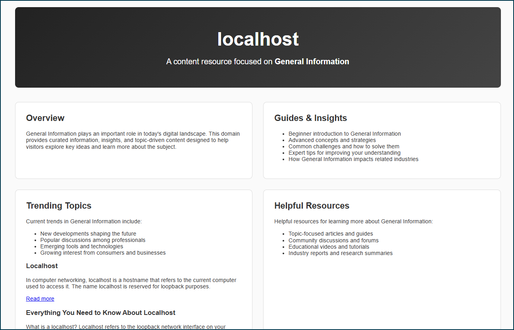
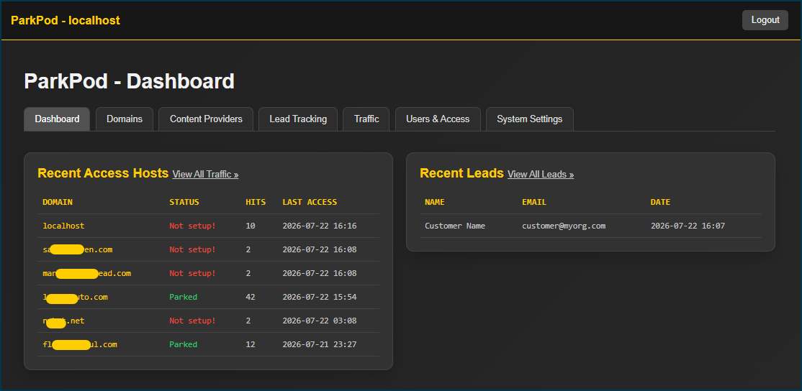
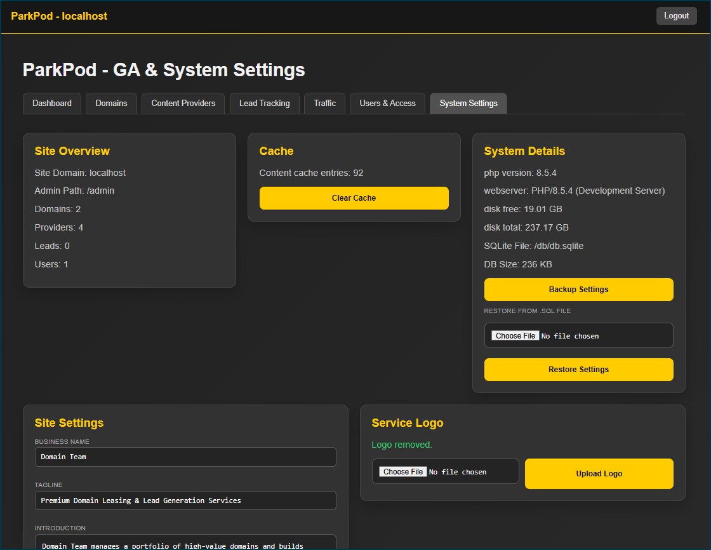
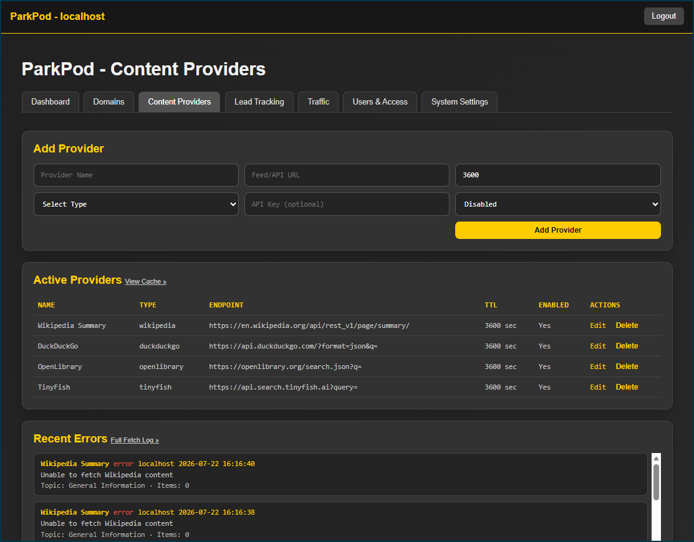
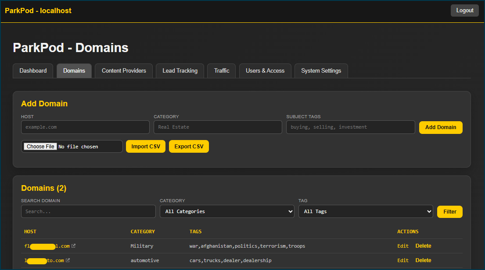
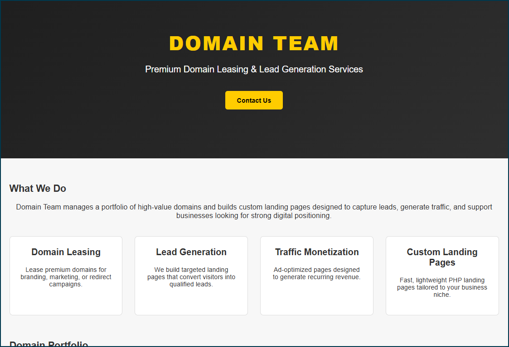

# ParkPod

A lightweight, self-hosted domain parking and lead generation platform built with PHP and SQLite. Park domains with dynamic content, capture leads, and manage everything from a clean admin panel - no frameworks, no dependencies, no database server required.





## Key Points

- **Zero dependencies** - pure PHP 8+, SQLite, no Composer, no Node.js
- **Multi-domain** - serve unique parked pages per domain from a single install
- **Dynamic content** - auto-populate pages from RSS, Wikipedia, DuckDuckGo, Reddit, OpenLibrary, and TinyFish
- **Lead generation** - contact forms with Google reCAPTCHA v3 on every parked page
- **Admin panel** - dashboard, domain management, content providers, leads, traffic logs, settings, backup/restore
- **Responsive** - mobile-friendly parked pages and service landing page out of the box
- **SEO-ready** - auto-generated meta titles, descriptions, and Open Graph tags per domain

## Requirements

- PHP 8.0+ with PDO SQLite extension
- Apache with `mod_rewrite` enabled
- Write access to `db/` directory (for SQLite database)
- Write access to `htmldocs/includes/media/` (for service logo uploads)

## Installation

1. **Clone the repo**

   ```bash
   git clone https://github.com/youruser/park-pod.git
   cd park-pod
   ```

2. **Create config file**

   ```bash
   cp _config/config.prod.disable.php _config/config.prod.php
   ```

   Edit `_config/config.prod.php` and set:
   - `admin_domain` - the domain where admin access lives (e.g. `servicedomain.com`)
   - `admin_path` - URI path for admin (default `/admin`)
   - Remove any hardcoded `admin` username/password (you'll create your account on first run)

3. **Point your web root** to the `htmldocs/` directory

4. **Set file permissions**

   ```bash
   chmod -R 755 db/
   chmod -R 755 htmldocs/includes/media/
   ```

5. **Visit your admin domain** - you'll be prompted to create the initial admin account

6. **Add your parked domains** - point their DNS to your server and add them in Admin > Domains

## Configuration

Development config lives in `_config/config.php` (gitignored). 
Production config lives in `_config/config.prod.php`

- DO NOT include config.php when publishing to production. It is intended for local testing and development.
- DO NOT use config.prod.php in development environmet, it will override config.php
- Ensure config.prod.php exists in production environment.
- Only use [admin][username] and [admin][password] in the event of a lockout. It will provide access to user management only.

The available keys:

```php
return [
    'site' => [
        'domain'        => $host,               // auto-detected
        'admin_domain'  => 'servicedomain.com', // admin lives here
        'admin_path'    => '/admin',
    ],
    'admin' => [
        'title'     => 'ParkPod',
        'username'  => 'admin',                 // login override user - DO NOT USE UNLESS LOCKED OUT
        'password'  => 'admin',                 // login override password - DO NOT USE UNLESS LOCKED OUT
    ],
    'database' => [
        'path' => '/db/db.sqlite',
    ],
];
```

All other settings are stored in the database and configurable from Admin > Settings:

| Setting | Description |
|---------|-------------|
| `business_name` | Displayed in service page header/footer and park pages |
| `tagline` | Hero subtitle on service page |
| `intro` | "What We Do" section on service page |
| `lease_email` | Contact email for domain leasing |
| `lead_email` | Where lead notifications are sent |
| `admin_domain` | Which domain serves the admin panel |
| `ga_id` | Google Analytics ID for parked pages |
| `admin_google_analytics` | Google Analytics ID for service page |
| `recaptcha_site_key` | Google reCAPTCHA v3 site key |
| `recaptcha_secret_key` | Google reCAPTCHA v3 secret key |
| `service_logo` | Logo filename for service page header |



## Project Structure

```
park-pod/
├── _config/
│   └── config.php              # Site config (gitignored)
├── app/
│   ├── app.php                 # Core App, Auth, DB init
│   ├── content.php             # Content providers, SEO, caching
│   ├── router.php              # Request routing
│   ├── helpers.php             # Utility functions
│   └── providers/              # Content provider classes
│       ├── base.php            # Abstract base provider
│       ├── duckduckgo.php      # DuckDuckGo search results
│       ├── openlibrary.php     # Open Library books
│       ├── reddit.php          # Reddit posts
│       ├── rss.php             # RSS/Atom feeds
│       ├── tinyfish.php        # TinyFish search API
│       └── wikipedia.php       # Wikipedia articles
├── db/
│   ├── schema.sql              # Database schema
│   └── db.sqlite               # SQLite database (gitignored)
├── htmldocs/                   # Web root
│   ├── .htaccess               # Apache URL rewriting
│   ├── index.php               # Entry point
│   ├── content/
│   │   ├── admin/              # Admin panel templates
│   │   │   ├── dashboard.php
│   │   │   ├── domains.php
│   │   │   ├── providers.php
│   │   │   ├── content.php
│   │   │   ├── leads.php
│   │   │   ├── traffic.php
│   │   │   ├── settings.php
│   │   │   ├── users.php
│   │   │   ├── cache.php
│   │   │   └── style.css
│   │   ├── park/               # Parked domain pages
│   │   │   ├── home.php
│   │   │   ├── about.php
│   │   │   └── style.css
│   │   ├── service/            # Service/leasing landing page
│   │   │   ├── home.php
│   │   │   └── style.css
│   │   └── style.css           # Shared public styles
│   └── includes/
│       └── media/              # Uploaded assets (logos)
```

## Admin Panel

Access at `https://your-admin-domain/admin`

### Pages

| Page | Description |
|------|-------------|
| **Dashboard** | Overview of domains, traffic, and recent activity |
| **Domains** | Add/edit/delete parked domains with categories and tags |
| **Providers** | Configure content providers (RSS, Wikipedia, DuckDuckGo, etc.) |
| **Content** | Browse and manage cached content from providers |
| **Leads** | View, archive, restore, and delete captured leads |
| **Traffic** | Filterable, sortable access log with host/domain/date filters |
| **Settings** | Business identity, analytics, reCAPTCHA, service logo |
| **Users** | Manage admin accounts and roles |
| **Cache** | View and clear content provider cache |

### Traffic Log Features

- Filter by domain, host (partial match), and date range
- Sortable columns (date, domain, host, path)
- Paginated at 50 entries per page
- Export filtered results to CSV
- Clear filtered entries
- IP lookup links (ARIN + reverse IP)

### Leads Features

- Active and Archived views with counts
- Archive/Restore individual leads
- Permanent delete with confirmation
- Export to CSV (respects active/archived view)
- Paginated at 50 per page

## Content Providers

Providers fetch external content to populate parked pages dynamically.

| Provider | Type | Description |
|----------|------|-------------|
| **RSS** | Feed | Any RSS or Atom feed URL |
| **Wikipedia** | API | Random articles from a category |
| **DuckDuckGo** | API | Search results and abstracts |
| **Reddit** | Feed | Subreddit RSS feeds |
| **OpenLibrary** | API | Book search by subject |
| **TinyFish** | API | Web search results (requires API key) |

Each provider supports configurable TTL (cache duration), per-domain topic targeting, and detailed fetch logging.



## Parked Domain Pages

Each parked domain gets:

- **Home page** - dynamic content sections (guides, trending, resources) populated from providers
- **About page** - domain info with contact form and reCAPTCHA
- Automatic SEO meta tags (title, description, Open Graph)
- Topic inference from domain name or referrer
- Responsive mobile layout



## Service Landing Page

The admin domain serves a professional landing page with:

- Hero section with business branding and contact CTA
- "What We Do" feature grid
- Domain portfolio showcase
- Pricing table
- Modal contact form with reCAPTCHA v3
- Responsive design



## Backup & Restore

From Admin > Settings:

- **Backup** - exports providers, settings, and parked domains as SQL (excludes user accounts and logs)
- **Restore** - imports a backup file, clearing existing data first to avoid conflicts

## Database

SQLite - no database server needed. Schema is auto-applied on first run and migrations run automatically.

### Tables

| Table | Purpose |
|-------|---------|
| `parked_domains` | Domain configurations |
| `providers` | Content provider definitions |
| `content_cache` | Cached provider responses |
| `provider_fetch_logs` | Provider fetch history and errors |
| `leads` | Captured contact form leads |
| `access_logs` | Traffic/access log |
| `users` | Admin user accounts |
| `settings` | Key-value application settings |

## License

MIT
